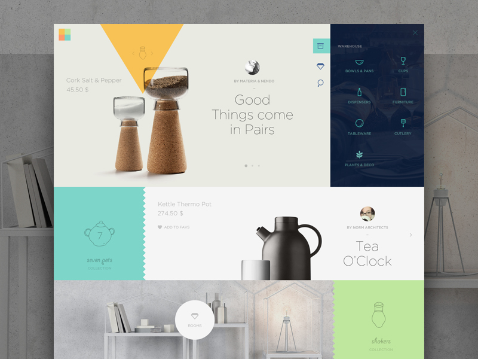
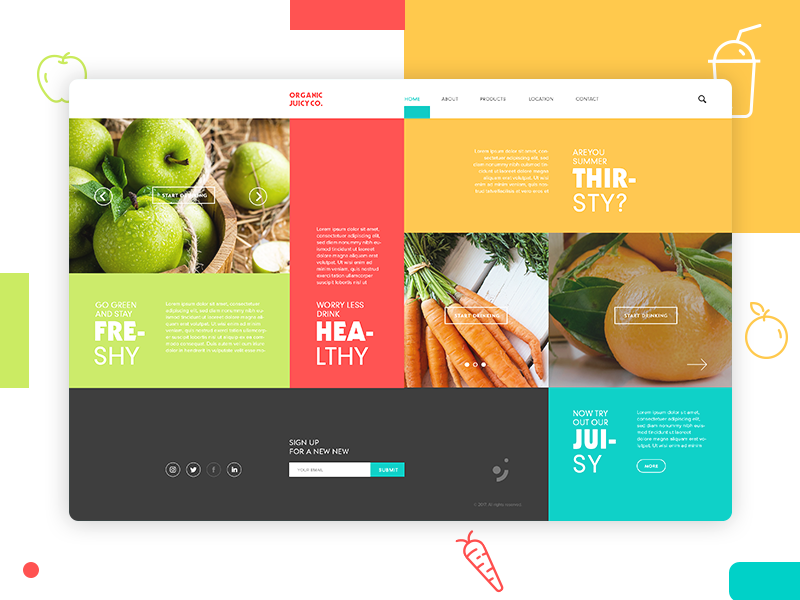
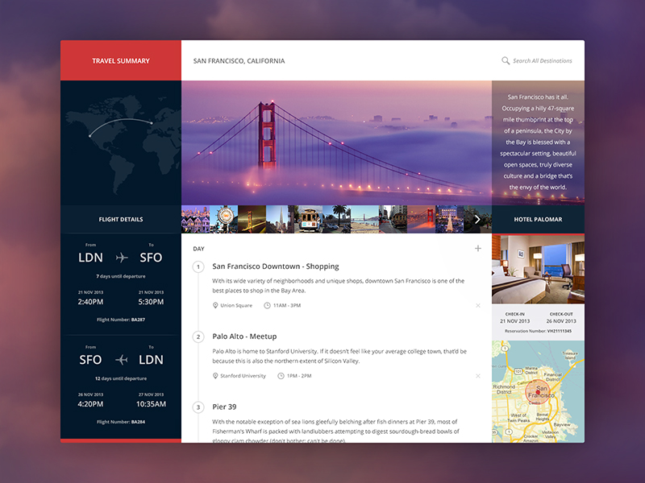

If you've been to any web design talk in the last couple of years, you've probably seen this famous tweet by Jon Gold:

<blockquote class="twitter-tweet" data-lang="de"><p lang="en" dir="ltr">which one of the two possible websites are you currently designing? <a href="https://t.co/ZD0uRGTqqm">pic.twitter.com/ZD0uRGTqqm</a></p>&mdash; Jon Gold (@jongold) <a href="https://twitter.com/jongold/status/694591217523363840?ref_src=twsrc%5Etfw">2. Februar 2016</a></blockquote>

It mocks the fact that a lot of today's websites look the same, as they all follow the same standard layout practices that we've collectively decided to use. Building a blog? Main column, widget sidebar. A marketing site? Big hero image, three teaser boxes (it _has_ to be three).

When we look back at what the web was like in earlier days, I think there's room for a lot more creativity in web design today.

## Enter CSS Grid

[Grid](https://www.w3.org/TR/css-grid-1/) is the first real tool for layout on the web. Everything we had up until now, from tables to floats to absolute positioning to flexbox - was meant to solve a different problem, and we found ways to use and abuse it for layout purposes.

The point of these new tools is not to build the same things again with different underlying technology. It has a lot more potential: It could re-shape the way we think about layout and enable us to do entirely new, different things on the web.

Now I know it's hard to get into a fresh mindset when you've been building stuff a certain way for a long time. We're trained to think about websites as header, content and footer. Stripes and boxes. 

But to keep our industry moving forward (and our jobs interesting), it's a good idea to take a step back once in a while and rethink how we do things.

If we didn't, we'd still be building stuff with spacer gifs and all-uppercase `<TABLE>` tags. 😉

<!-- On the other hand, it's important to look at some of the established patterns and ask yourself why they're there. What problem do they solve? Why did they win over others? Innovation should never be done just for innovation's sake - but as with everything, there's different ways we can approach it. -->

## So, how could things look?

I went over to dribbble in search of layout ideas that are pushing the envelope a bit. The kind of design that would make frontend developers like me frown at first sight.

There's a lot of great work out there - here's a few of my favorites:

<figure>
    <a href="https://dribbble.com/shots/1573896-Warehouse" rel="noopener noreferrer" target="_blank">
        
    </a>
    <figcaption>
        "Warehouse" by <a href="https://dribbble.com/Radium" rel="noopener noreferrer" target="_blank">Cosmin Capitanu</a>
    </figcaption>
</figure>

<figure>
    <a href="https://dribbble.com/shots/2375246-Fashion-Butique-slider-animation" rel="noopener noreferrer" target="_blank">
        
    </a>
    <figcaption>
        "Fashion Boutique" by <a href="https://dribbble.com/KreativaStudio" rel="noopener noreferrer" target="_blank">KREATIVA Studio</a>
    </figcaption>
</figure>

<figure>
    <a href="https://dribbble.com/shots/4316958-Organic-Juicy-Co-Landing-Page" rel="noopener noreferrer" target="_blank">
        
    </a>
    <figcaption>
        "Organic Juicy Co." by <a href="https://dribbble.com/broklinonjei" rel="noopener noreferrer" target="_blank">Broklin Onjei</a>
    </figcaption>
</figure>

<figure>
    <a href="https://dribbble.com/shots/1349782-Travel-Summary" rel="noopener noreferrer" target="_blank">
        
    </a>
    <figcaption>
        "Travel Summary" by <a href="https://dribbble.com/Radium" rel="noopener noreferrer" target="_blank">Piotr Adam Kwiatkowski</a>
    </figcaption>
</figure>

<figure>
    <a href="https://dribbble.com/shots/2652364-Digital-Walls" rel="noopener noreferrer" target="_blank">
        
    </a>
    <figcaption>
        "Digital Walls" by <a href="https://dribbble.com/Radium" rel="noopener noreferrer" target="_blank">Cosmin Capitanu</a>
    </figcaption>
</figure>

I especially like that last one. It reminds me a bit of the "Metro Tiles" that were all the rage in Windows 8. Not only is this visually impressive, its very flexible too - I could see this working on a phone, a tablet, even on huge TV screens or in augemented reality, as suggested by the designer.

How hard is it to build something like this, given the tools we have today?

I tried to approach this as if I was handed the design on my regular job - with real production constraints in mind. So the interface had to be responsive, performant and accessible. (Designs are not required to be pixel-perfect everywhere though, cause you know - [that's not a real thing](http://dowebsitesneedtobeexperiencedexactlythesameineverybrowser.com/).)

Here's how it turned out:

<div class="extend">
    <video poster="cover.jpg" width="960" style="margin:0 auto;" preload controls>
        <source src="demo.webm" type="video/webm" />
        <source src="demo.mp4" type="video/mp4" />
    </video>
</div>

You can check out <a href="https://codepen.io/mxbck/live/81020404c9d5fd873a717c4612c914dd" target="_blank" rel="noopener noreferrer">the final result</a> on Codepen.

👉 *Since this is just for demo purposes, I chose not to include fallbacks and polyfills for older browsers. My goal was to test the capabilities of modern tools here. I found that it works best in recent Firefox or Chrome versions.*

Some of the things that made this interesting:

### Layout

Unsurprisingly, the essential factor for the "Metro Tiles" is the grid. The entire layout logic fits inside this block:

```scss
.boxgrid {
    display:grid;
    grid-template-columns: repeat(auto-fit, minmax(150px, 1fr));
    grid-auto-rows: minmax(150px, auto);
    grid-gap: 2rem .5rem;

    &__item {
        display:flex;

        &--wide {
            grid-column: span 2;
        }
        &--push {
            grid-column: span 2;
            padding-left: 50%;
        }
    }
}
```

The magic is mostly in the second line there. `repeat(auto-fit, minmax(150px, 1fr))` handles the column creation responsively, meaning it will fit as many boxes as possible in a row to make sure they align with the outer edges.

The `--push` modifier class is used to achieve the design's effect where some boxes "skip" a column. Since this is not easily possible without explicitly setting the grid lines, I opted for this trick: The actual grid cell spans two columns, but only allows enough space for the box to fill have the cell.

### Animation

The original design shows that the section backgrounds and the tile grid move at different speeds, creating the illusion of depth. Nothing extraordinary, just some good old parallax.

While this effect is usually achieved by hooking into the scroll event and then applying different `transform` styles via Javascript, there's a better way to do it, entirely without Javascript. This reduces the number of repaints the browser has to perform.

The secret here is to leverage CSS 3D transforms to separate the layers along the z-axis. [This technique](https://developers.google.com/web/updates/2016/12/performant-parallaxing) by Scott Kellum and Keith Clark essentially works by using `perspective` on the scroll container and `translateZ` on the parallax children:

```css
.container {
  height: 100%;
  overflow-x: hidden;
  overflow-y: scroll;
  perspective: 1px;
  perspective-origin: 0 0;
}

.parallax-child {
  transform-origin: 0 0;
  transform: translateZ(-2px) scale(3);
}
```

A huge benefit of this method is the improved performance, resulting in an almost 60fps smooth parallax scroll.

### Scrolling

The only Javascript involved is handling the smooth scrolls when the menu items on the left, or the direction arrows on top/bottom are clicked. This is progressively enhanced from a simple in-page-anchor like `<a href="#vienna">` that jumps to the selected section. 

To animate it, I chose to use the vanilla `Element.scrollIntoView()` method [(MDN Docs)](https://developer.mozilla.org/de/docs/Web/API/Element/scrollIntoView). It accepts an option to use "smooth" scrolling behaviour instead of jumping to the target section right away.

The [scroll behaviour property](https://developer.mozilla.org/en-US/docs/Web/CSS/scroll-behavior) is currrently a Working Draft, so support is not quite there yet. Only Chrome and Firefox have native support at the moment - However, there is [a polyfill](http://iamdustan.com/smoothscroll/) available if necessary.

## Other cool layouts in production

[Invision "Design Genome" Site](https://www.invisionapp.com/enterprise/design-genome)
